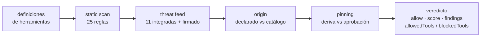

# WARDEN — cortafuegos de seguridad para MCP

<!-- aicom-readme-badges -->
<p align="center">
  <a href="https://github.com/alexar76/warden/actions/workflows/ci.yml"></a>
  <a href="https://www.npmjs.com/package/@aimarket/warden"></a>
  
  
  = 20" />
  <a href="LICENSE"></a>
</p>
<!-- /aicom-readme-badges -->

<p align="center">
  
</p>


> 🌐 [English](README.md) · [Русский](README-ru.md) · **Español** · [Français](README-fr.md) · [中文](README-zh.md) · [Glosario](https://github.com/alexar76/aicom/blob/main/docs/localization-glossary.md)

Un servidor MCP le dice a tu agente qué hacen sus herramientas. El agente se lo cree — y esa frase
es la superficie de ataque. La descripción de una herramienta es texto de prompt que un tercero
entrega directamente al contexto de tu modelo, y un campo de esquema llamado `api_key` es una
petición de tus secretos redactada como si fuera una API.

WARDEN examina un servidor **antes de que ninguna de sus herramientas llegue al modelo**, y devuelve
un veredicto que puedes registrar: permitir/bloquear, una puntuación 0..1, los hallazgos que la
produjeron, una partición por herramienta y la tabla de reglas exacta que estaba en vigor.

```bash
npm install @aimarket/warden
```

**Cero dependencias de ejecución.** El único import de todo el paquete es `node:crypto`. Es el
cortafuegos de [ARGUS](https://github.com/alexar76/argus), extraído para que puedas ponerlo delante
de tu propio host MCP sin adoptar un agente.

## Inicio rápido

```ts
import { Warden, ThreatFeed, silentLogger } from "@aimarket/warden";

const threatFeed = new ThreatFeed({ feedPublicKey: process.env.FEED_PUBKEY });
await threatFeed.load(process.env.FEED_URL); // sin URL → solo la lista de denegación integrada, sin red

const pins = new Map();
const warden = Warden.create({
  policy: {
    blockAtSeverity: "high",
    sensitiveToolPatterns: ["*delete*", "*transfer*", "*key*"],
    allowUnknownServers: false, // fail-closed: solo los servidores que declaraste
    pinToolDefs: true,
  },
  threatFeed,
  store: {
    getPin: async (id) => pins.get(id),
    putPin: async (p) => void pins.set(p.serverId, p),
  },
  log: silentLogger(), // o tu propio logger
});

const verdict = await warden.vet(server, await client.listTools());

if (!verdict.allow) throw new Error(`bloqueado por ${verdict.decidedBy}`);
const usable = verdict.allowedTools; // una herramienta envenenada puede quedar aislada sola
await warden.approve(server, tools); // fija (pin) lo que el usuario aceptó
```

`vet()` **no hace ninguna petición de red**. La única petición que WARDEN llega a hacer es la
descarga del threat feed que tú pediste al pasar una URL a `load()`.

## La cadena de puertas



| Puerta | Qué decide | Red | ¿Fatal? |
|---|---|---|---|
| **static-scan** | Inyección, exfiltración, peticiones de credenciales y señales de Unicode oculto/base64 en el `name`, la `description` y el `inputSchema` de la herramienta — 25 reglas, v3, de las cuales 18 pueden bloquear y 7 son solo de aviso, y 17 cubren también el nombre | ninguna | no |
| **threat-feed** | Identidad de servidor o herramienta conocida como maliciosa: 11 registros integrados más un feed firmado opcional | solo la descarga del feed | sí, para un `critical` con alcance de servidor |
| **origin** | Si el operador declaró este servidor o llegó desde un catálogo remoto | ninguna | sí, con `allowUnknownServers: false` |
| **pinning** | Si las definiciones de herramientas siguen coincidiendo con lo que el usuario aprobó | ninguna | sí, con `pinToolDefs: true` |

La puntuación compuesta es el **producto** de las contribuciones de cada puerta: una puerta mala
arrastra al servidor entero en lugar de promediarse. Severidad y bloqueo son ejes distintos: un
hallazgo `advisory` se reporta y nunca bloquea ni cuesta una herramienta, con cualquier
`blockAtSeverity` — porque «cuánta atención merece esto» y «¿es esto un defecto?» son preguntas
distintas, y codificar la segunda como una severidad baja volvía a hacerla bloqueante para quien
endureciera el umbral.

## El veredicto está pensado para quedar registrado

```ts
{
  allow: false,
  score: 0,
  decidedBy: "threat-feed",
  findings: [{ gate, severity, code: "THREAT_TOOL_MATCH", message, tool, advisory? }],
  allowedTools: ["add"],
  blockedTools: ["sweeper"],
  rulesets: { staticScan: { version: "3", digest: "sha256-pah/sT4I…" } }
}
```

`rulesets` no es decoración. El mismo servidor puntúa distinto bajo una tabla de reglas posterior, y
sin la versión *y* un digest sobre las reglas no hay forma de distinguir eso de que el servidor haya
cambiado. Un escaneo guardado sin ellos no es reproducible.

## Threat feed firmado

WARDEN no leerá un feed remoto sin firma. El contrato es deliberadamente aburrido:

```
GET <la url de tu feed>
{ "records": [ {pattern, severity, code, reason, source, scope}, … ],
  "timestamp": 1786205907380,   // epoch ms, entero — obligatorio
  "signature": "f588d5a4…"      // Ed25519 (hex) sobre la forma canónica
}                               // RFC 8785 de {records, timestamp}
```

Se comprueban tres propiedades, y **cualquier fallo conserva el suelo integrado** en lugar de
degradar a ninguna protección:

1. **autenticidad** — Ed25519 contra la clave que fijaste de antemano (`feedPublicKey`);
2. **frescura** — el timestamp *firmado* debe caer dentro de `maxAgeMs` (24 h por defecto), para que
   quien sirve la URL no pueda reproducir una instantánea de hace meses y borrar en silencio cada
   registro añadido desde entonces. Una firma dice quién escribió un documento, nunca cuándo te lo
   entregaron;
3. **determinismo** — bytes canónicos RFC 8785, para que editor y verificador coincidan sin importar
   el orden de las claves JSON.

[MOMUS](https://github.com/alexar76/momus) es un editor de referencia de este contrato
(`/warden/threat-feed`) si necesitas algo a lo que apuntar con `load()`.

## También incluido

- **`EgressGuard`** — una lista de permitidos de salida con la que envolver cualquier petición que
  haga una herramienta. Una herramienta que alcanza un host que nunca listaste es la señal clásica de
  phone-home. `*.example.com` cubre subdominios; una lista vacía lo bloquea todo, no lo permite todo.
- **`isSensitiveTool` / `classifyTools`** — clasificación por glob de las herramientas que deben
  exigir aprobación en cada llamada. Las herramientas sensibles siguen *anunciadas*: simplemente no
  pueden ejecutarse sin supervisión.
- **`canonicalize` / `parseJsonStrict`** — una implementación estricta de RFC 8785 (JCS), exportada
  también como `@aimarket/warden/jcs` para poder comparar otra implementación byte a byte. Solo
  enteros más allá de `MAX_SAFE_JSON_INTEGER`, rechazo (no escapado) de surrogados solitarios y un
  código de motivo en cada rechazo.

## Documentación

| | |
|---|---|
| [La cadena de puertas](docs/gates.es.md) | Cada nivel de regla, cada código de hallazgo, cómo se construye la puntuación compuesta y cómo añadir una puerta |
| [El threat feed firmado](docs/threat-feed.es.md) | El contrato en el cable, las tres comprobaciones y cómo publicar un feed que WARDEN acepte |
| [Guía de integración](docs/integration.es.md) | Cómo conectar WARDEN a tu propio host MCP, elecciones de política y qué registrar |
| [Estudio de campo: 1 108 servidores MCP públicos](docs/mcp-survey.es.md) | Qué decidió WARDEN sobre definiciones de herramienta reales de terceros — 50 servidores bloqueados, 4 sustentados, y las seis formas en que el resto se equivocó |

## Lo que esto no es

- **No es un sandbox.** Son decisiones JS dentro del proceso. Aquí no hay confinamiento del proceso
  hijo MCP a nivel de sistema operativo (seccomp/Landlock, `sandbox-exec`).
- **No es un modelo.** En ninguna parte de la cadena se llama a un LLM. Por eso `vet()` es rápido,
  offline y determinista — y por eso el escaneo estático tiene forma de regex y se le escapará una
  paráfrasis que ninguna regla cubra.
- **No es un servicio de reputación.** Una versión anterior tenía una puerta que pedía a un oráculo
  de confianza una puntuación para la que no tenía datos, y luego informaba de que el oráculo era
  inalcanzable sin haber enviado ninguna petición. Se eliminó, y
  `test/no-phantom-gate.test.ts` falla si alguna puerta vuelve a declarar inalcanzabilidad.
- **No sustituye a leer las definiciones de herramientas.** 11 registros integrados de amenazas son
  un suelo, no un catálogo.

## Desarrollo

```bash
npm install && npm run build && npm test   # 122 pruebas
```

`test/packaging.test.ts` es lo que mantiene honesto el titular: falla si aparece una dependencia de
ejecución, si algún fichero fuente importa fuera del paquete o si el punto de entrada deja de
exportar la superficie de aplicación.

Usado por [ARGUS](https://github.com/alexar76/argus) (el host de referencia),
[MOMUS](https://github.com/alexar76/momus) (el lado editor) y el curso de seguridad MCP de AICOM.

MIT © AICOM (alexar76)
