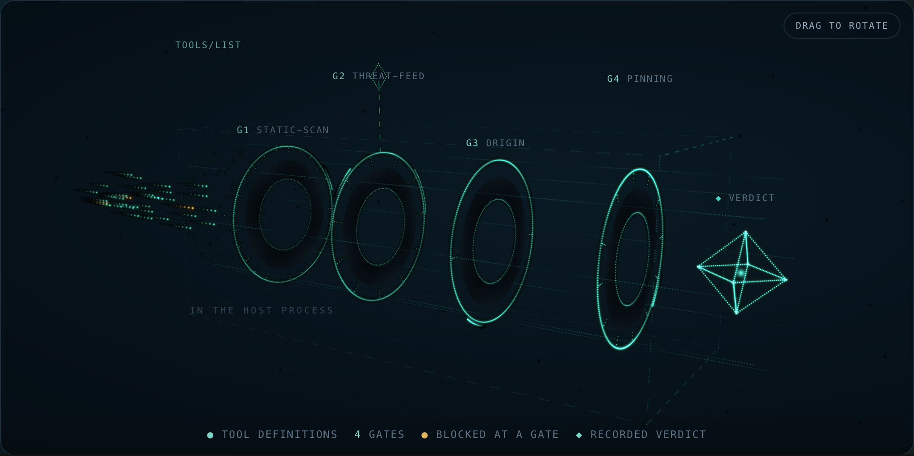
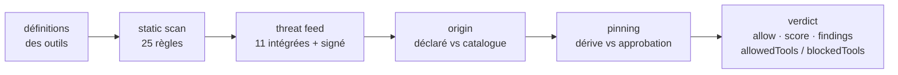

# WARDEN — serveur MCP

<!-- mcp-name: io.github.alexar76/warden -->

<!-- aicom-readme-badges -->
<p align="center">
  <a href="https://github.com/alexar76/warden/actions/workflows/ci.yml"></a>
  <a href="https://glama.ai/mcp/servers/alexar76/warden"></a>
  <a href="https://warden.modelmarket.dev/"></a>
  
  
  = 20" />
  <a href="LICENSE"></a>
</p>
<!-- /aicom-readme-badges -->

<p align="center">
  <a href="https://warden.modelmarket.dev/">
    
  </a>
</p>


> 🌐 [English](README.md) · [Русский](README-ru.md) · [Español](README-es.md) · **Français** · [中文](README-zh.md) · [Glossaire](https://github.com/alexar76/aicom/blob/main/docs/localization-glossary.md)

**Un serveur MCP. Pare-feu des définitions d'outils annoncées. Bibliothèque incluse.**

Transport : **stdio** (`npx -y @aimarket/warden` / `node dist/mcp-server.js`). Hôtes compatibles :
Claude Desktop, Cursor, Glama et tout client MCP en stdio. Aucune clé.

| | |
|------|----------|
| Entrée MCP (stdio) | `warden-mcp` → [`src/mcp-server.ts`](src/mcp-server.ts) |
| Outils | `vet_mcp_server`, `static_scan_tools`, `classify_sensitive_tools`, `check_egress_url`, `canonicalize_json`, `list_scan_rules` |
| Bibliothèque | `import { Warden } from "@aimarket/warden"` |
| Glama / Docker (stdio) | [`Dockerfile`](Dockerfile), [`glama.json`](glama.json) |

Un serveur MCP indique lui-même à votre agent ce que font ses outils. L'agent le croit — et cette
phrase est la surface d'attaque. La description d'un outil est du texte de prompt qu'un tiers livre
directement dans le contexte de votre modèle, et un champ de schéma nommé `api_key` est une demande
de vos secrets formulée comme une API.

WARDEN examine un serveur **avant qu'aucun de ses outils n'atteigne le modèle**, et renvoie un verdict
que vous pouvez consigner : autoriser/bloquer, un score 0..1, les constats qui l'ont produit, une
partition par outil et la table de règles exacte qui était en vigueur.

**Zéro dépendance npm d'exécution.** Le seul import de la bibliothèque est `node:crypto`. Le serveur
MCP stdio ajoute d'autres builtins `node:` (`fs`, `path`, `process`) et ne tire toujours aucun paquet.
C'est le pare-feu d'[ARGUS](https://github.com/alexar76/argus), extrait pour que vous puissiez le
placer devant votre propre hôte MCP sans adopter d'agent.

## Lancer comme serveur MCP (stdio)

```bash
npx -y @aimarket/warden
npm run build && node dist/mcp-server.js
```

Claude Desktop / Cursor (`mcpServers`) :

```json
{
  "mcpServers": {
    "warden": {
      "command": "npx",
      "args": ["-y", "@aimarket/warden"]
    }
  }
}
```

Le processus ne démarre, ne proxifie ni n'isole un autre serveur MCP : vous passez un dump
`tools/list`, vous récupérez un verdict.

| Outil | Quand l'appeler |
|---|---|
| `vet_mcp_server` | Chaîne complète de portes |
| `static_scan_tools` | Scan statique uniquement |
| `classify_sensitive_tools` | Partition par globs opérateur |
| `check_egress_url` | Allowlist d'hôtes (liste vide = tout refuser) |
| `canonicalize_json` | Octets RFC 8785 |
| `list_scan_rules` | Table de règles publiée |

### Publier sur Glama

Listing : **[glama.ai/mcp/servers/alexar76/warden](https://glama.ai/mcp/servers/alexar76/warden)**

Même modèle que [ARGUS](https://github.com/alexar76/argus) et
[aimarket-mcp](https://github.com/alexar76/aimarket-mcp) : [`glama.json`](glama.json) +
[`Dockerfile`](Dockerfile) + `node dist/mcp-server.js`. Formulaire : [`docs/GLAMA.md`](docs/GLAMA.md).

## Bibliothèque (embarquer dans votre hôte)

```bash
npm install @aimarket/warden
```

```ts
import { Warden, ThreatFeed, silentLogger } from "@aimarket/warden";

const threatFeed = new ThreatFeed({ feedPublicKey: process.env.FEED_PUBKEY });
await threatFeed.load(process.env.FEED_URL); // sans URL → uniquement la liste de refus intégrée, sans réseau

const pins = new Map();
const warden = Warden.create({
  policy: {
    blockAtSeverity: "high",
    sensitiveToolPatterns: ["*delete*", "*transfer*", "*key*"],
    allowUnknownServers: false, // fail-closed : uniquement les serveurs que vous avez déclarés
    pinToolDefs: true,
  },
  threatFeed,
  store: {
    getPin: async (id) => pins.get(id),
    putPin: async (p) => void pins.set(p.serverId, p),
  },
  log: silentLogger(), // ou votre propre logger
});

const verdict = await warden.vet(server, await client.listTools());

if (!verdict.allow) throw new Error(`bloqué par ${verdict.decidedBy}`);
const usable = verdict.allowedTools; // un outil empoisonné peut être isolé seul
await warden.approve(server, tools); // épingler (pin) ce que l'utilisateur a accepté
```

`vet()` **n'effectue aucune requête réseau**. La seule requête que WARDEN émet jamais est le
téléchargement du threat feed que vous avez demandé en passant une URL à `load()`.

## La chaîne de portes



| Porte | Ce qu'elle décide | Réseau | Fatale ? |
|---|---|---|---|
| **static-scan** | Injection, exfiltration, demandes d'identifiants et indices d'Unicode masqué/base64 dans le `name`, la `description` et l'`inputSchema` de l'outil — 25 règles, v4, dont 15 peuvent bloquer et 10 sont purement indicatives, 17 couvrent aussi le nom et 12 portent un guard de contexte | aucun | non |
| **threat-feed** | Identité de serveur ou outil connu comme malveillant : 11 enregistrements intégrés plus un feed signé optionnel | seulement le téléchargement du feed | oui, pour un `critical` de portée serveur |
| **origin** | Si l'opérateur a déclaré ce serveur ou s'il provient d'un catalogue distant | aucun | oui, avec `allowUnknownServers: false` |
| **pinning** | Si les définitions d'outils correspondent encore à ce que l'utilisateur a approuvé | aucun | oui, avec `pinToolDefs: true` |

Le score composite est le **produit** des contributions de chaque porte : une seule porte mauvaise
entraîne tout le serveur vers le bas au lieu d'être moyennée. Sévérité et blocage sont deux axes
distincts : un constat `advisory` est rapporté et ne bloque jamais et ne coûte jamais un outil, quel
que soit `blockAtSeverity` — parce que « quelle attention cela mérite-t-il » et « est-ce un défaut »
sont deux questions différentes, et encoder la seconde par une sévérité basse la rendait de nouveau
bloquante pour quiconque durcissait le seuil.

## Le verdict est fait pour être consigné

```ts
{
  allow: false,
  score: 0,
  decidedBy: "threat-feed",
  findings: [{ gate, severity, code: "THREAT_TOOL_MATCH", message, tool, advisory? }],
  allowedTools: ["add"],
  blockedTools: ["sweeper"],
  rulesets: { staticScan: { version: "4", digest: "sha256-klRyTiD3…" } }
}
```

`rulesets` n'est pas un ornement. Le même serveur obtient un autre score sous une table de règles
plus récente, et sans la version *et* une empreinte des règles, rien ne permet de distinguer cela
d'un serveur qui a changé. Un scan conservé sans elles n'est pas reproductible.

## Threat feed signé

WARDEN ne lira pas un feed distant non signé. Le contrat est délibérément ennuyeux :

```
GET <l'url de votre feed>
{ "records": [ {pattern, severity, code, reason, source, scope}, … ],
  "timestamp": 1786205907380,   // epoch ms, entier — obligatoire
  "signature": "f588d5a4…"      // Ed25519 (hex) sur la forme canonique
}                               // RFC 8785 de {records, timestamp}
```

Trois propriétés sont vérifiées, et **tout échec conserve le socle intégré** au lieu de dégrader vers
une absence de protection :

1. **authenticité** — Ed25519 contre la clé que vous avez épinglée à l'avance (`feedPublicKey`) ;
2. **fraîcheur** — le timestamp *signé* doit tomber dans `maxAgeMs` (24 h par défaut), afin que celui
   qui sert l'URL ne puisse pas rejouer un instantané vieux de plusieurs mois et effacer en silence
   chaque enregistrement ajouté depuis. Une signature dit qui a écrit un document, jamais quand il
   vous a été remis ;
3. **déterminisme** — octets canoniques RFC 8785, pour que l'éditeur et le vérificateur s'accordent
   quel que soit l'ordre des clés JSON.

[MOMUS](https://github.com/alexar76/momus) est un éditeur de référence de ce contrat
(`/warden/threat-feed`) si vous cherchez une cible pour `load()`.

## Également inclus

- **`EgressGuard`** — une liste blanche de sortie pour envelopper toute requête émise par un outil.
  Un outil qui joint un hôte que vous n'avez jamais listé est le signe classique du phone-home.
  `*.example.com` couvre les sous-domaines ; une liste vide bloque tout, au lieu de tout autoriser.
- **`isSensitiveTool` / `classifyTools`** — classification par glob des outils qui doivent exiger une
  approbation à chaque appel. Les outils sensibles restent *annoncés* : ils ne peuvent simplement pas
  s'exécuter sans surveillance.
- **`canonicalize` / `parseJsonStrict`** — une implémentation stricte de RFC 8785 (JCS), également
  exportée sous `@aimarket/warden/jcs` afin qu'une autre implémentation puisse être vérifiée octet par
  octet. Entiers uniquement au-delà de `MAX_SAFE_JSON_INTEGER`, refus (et non échappement) des
  surrogates isolés, et un code de motif sur chaque refus.

## Documentation

| | |
|---|---|
| [La chaîne de portes](docs/gates.fr.md) | Chaque niveau de règle, chaque code de constat, la construction du score composite et comment ajouter une porte |
| [Le threat feed signé](docs/threat-feed.fr.md) | Le contrat sur le fil, les trois vérifications, et comment publier un feed que WARDEN acceptera |
| [Guide d'intégration](docs/integration.fr.md) | Brancher WARDEN sur votre propre hôte MCP, choix de politique, et quoi consigner |
| [Étude de terrain : 1 108 serveurs MCP publics](docs/mcp-survey.fr.md) | Ce que WARDEN a décidé sur de vraies définitions d'outil tierces — 50 serveurs bloqués, 4 étayés, et les six façons dont le reste était faux |
| [Glama / Docker](docs/GLAMA.md) | MCP stdio, health check, Build steps / CMD |
| [Security](SECURITY.md) | Signaler un contournement du pare-feu |
| [Contributing](CONTRIBUTING.md) | Règle zéro dépendance, PRs de table de règles |

## Ce que ce n'est pas

- **Pas un sandbox.** Ce sont des décisions JS intra-processus. Le confinement du processus enfant MCP
  au niveau du système d'exploitation (seccomp/Landlock, `sandbox-exec`) n'est pas ici.
- **Pas un modèle.** Aucun LLM n'est appelé dans la chaîne. C'est pourquoi `vet()` est rapide, hors
  ligne et déterministe — et pourquoi le scan statique a la forme d'expressions régulières et laissera
  passer une paraphrase qu'aucune règle ne couvre.
- **Pas un service de réputation.** Une version antérieure avait une porte qui demandait à un oracle
  de confiance un score qu'il n'avait aucune donnée pour calculer, puis signalait l'oracle comme
  injoignable sans avoir envoyé la moindre requête. Elle a été supprimée, et
  `test/no-phantom-gate.test.ts` échoue si une porte déclare de nouveau une injoignabilité.
- **Pas un substitut à la lecture des définitions d'outils.** 11 enregistrements de menaces intégrés
  sont un socle, pas un catalogue.
- **Pas un proxy.** L'entrée MCP stdio inspecte les définitions que vous lui passez. Elle ne se
  connecte pas au serveur examiné, ne le télécharge pas et ne l'exécute pas.

## Développement

```bash
npm install && npm run build && npm test   # 166 tests
```

`test/packaging.test.ts` est ce qui tient l'accroche honnête : il échoue si une dépendance d'exécution
apparaît, si un fichier source importe hors du paquet, ou si le point d'entrée cesse d'exporter la
surface d'application.

Utilisé par [ARGUS](https://github.com/alexar76/argus) (l'hôte de référence),
[MOMUS](https://github.com/alexar76/momus) (le côté éditeur) et le cours AICOM sur la sécurité MCP.

MIT © AICOM (alexar76)
