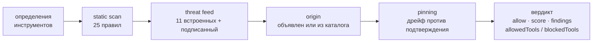

# WARDEN — файрвол безопасности MCP

<!-- aicom-readme-badges -->
<p align="center">
  <a href="https://github.com/alexar76/warden/actions/workflows/ci.yml"></a>
  <a href="https://warden.modelmarket.dev/"></a>
  
  
  = 20" />
  <a href="LICENSE"></a>
  <a href="https://glama.ai/mcp/servers/alexar76/warden"></a>
</p>
<!-- /aicom-readme-badges -->

<p align="center">
  <a href="https://warden.modelmarket.dev/">
    
  </a>
</p>


> 🌐 [English](README.md) · **Русский** · [Español](README-es.md) · [Français](README-fr.md) · [中文](README-zh.md) · [Глоссарий](https://github.com/alexar76/aicom/blob/main/docs/localization-glossary.md)

MCP-сервер сам сообщает вашему агенту, что делают его инструменты. Агент этому верит — и вот эта
фраза и есть поверхность атаки. Описание инструмента — это текст промпта, который третья сторона
доставляет прямо в контекст модели, а поле схемы с именем `api_key` — это запрос ваших секретов,
сформулированный как API.

WARDEN проверяет сервер **до того, как его инструменты дойдут до модели**, и возвращает вердикт,
который можно записать: allow/block, оценку 0..1, найденные проблемы, разбиение по инструментам и
точную таблицу правил, которая действовала в момент проверки.

```bash
npm install @aimarket/warden
```

**Ноль npm-зависимостей в рантайме.** В библиотеке единственный импорт — `node:crypto`. stdio MCP-вход
добавляет другие `node:` builtins (`fs`, `path`, `process`) и по-прежнему не тянет пакеты. Это файрвол из
[ARGUS](https://github.com/alexar76/argus), вынесенный отдельно, чтобы его можно было поставить
перед своим MCP-хостом, не переезжая на агента.

## MCP-сервер (stdio)

Продукт — библиотека. Те же гейты отдаются и как **stdio MCP-сервер**, чтобы их можно было вызвать из
[Glama](https://glama.ai/mcp/servers/alexar76/warden), Claude Desktop и Cursor. Процесс **не**
запускает, не проксирует и не изолирует чужой MCP-сервер: вы передаёте дамп `tools/list`, получаете
вердикт. Ключи не нужны.

```bash
npx -y @aimarket/warden
npm run build && node dist/mcp-server.js
```

| Инструмент | Когда вызывать |
|---|---|
| `vet_mcp_server` | Полная цепочка гейтов |
| `static_scan_tools` | Только static-scan |
| `classify_sensitive_tools` | Glob-разбиение оператора |
| `check_egress_url` | Allowlist хостов (пустой список — отказ всем) |
| `canonicalize_json` | Байты RFC 8785 |
| `list_scan_rules` | Опубликованная таблица правил |

Docker / форма Glama: [`docs/GLAMA.md`](docs/GLAMA.md).

## Быстрый старт

```ts
import { Warden, ThreatFeed, silentLogger } from "@aimarket/warden";

const threatFeed = new ThreatFeed({ feedPublicKey: process.env.FEED_PUBKEY });
await threatFeed.load(process.env.FEED_URL); // без URL → только встроенный deny-list, без сети

const pins = new Map();
const warden = Warden.create({
  policy: {
    blockAtSeverity: "high",
    sensitiveToolPatterns: ["*delete*", "*transfer*", "*key*"],
    allowUnknownServers: false, // fail-closed: только объявленные вами серверы
    pinToolDefs: true,
  },
  threatFeed,
  store: {
    getPin: async (id) => pins.get(id),
    putPin: async (p) => void pins.set(p.serverId, p),
  },
  log: silentLogger(), // или ваш собственный логгер
});

const verdict = await warden.vet(server, await client.listTools());

if (!verdict.allow) throw new Error(`заблокировано гейтом ${verdict.decidedBy}`);
const usable = verdict.allowedTools; // отравленный инструмент можно изолировать в одиночку
await warden.approve(server, tools); // зафиксировать (pin) то, что подтвердил пользователь
```

`vet()` **не делает сетевых запросов**. Единственный запрос, который WARDEN вообще выполняет, — это
загрузка threat feed, о которой вы попросили сами, передав URL в `load()`.

## Цепочка гейтов



| Гейт | Что решает | Сеть | Fatal? |
|---|---|---|---|
| **static-scan** | Инъекции, эксфильтрация, запросы учётных данных, скрытый Unicode и base64-признаки в `name`, `description` и `inputSchema` инструмента — 25 правил, версия 4, из них 15 могут блокировать и 10 только сообщают, 17 покрывают и имя, а у 12 есть контекстный guard | нет | нет |
| **threat-feed** | Известный плохой сервер или инструмент: 11 встроенных записей плюс опциональный подписанный feed | только загрузка feed | да, для `critical` на уровне сервера |
| **origin** | Объявил ли оператор этот сервер, или он пришёл из удалённого каталога | нет | да, при `allowUnknownServers: false` |
| **pinning** | Совпадают ли определения инструментов с тем, что подтвердил пользователь | нет | да, при `pinToolDefs: true` |

Composite score — это **произведение** вкладов гейтов: один плохой гейт тянет весь сервер вниз, а не
усредняется. Severity и блокировка — разные оси: находка с `advisory` сообщается, но никогда не
блокирует и никогда не стоит инструмента, при любом `blockAtSeverity`. Потому что «сколько внимания
это заслуживает» и «дефект ли это вообще» — разные вопросы, а кодирование второго через низкую
severity снова делало находку блокирующей для всех, кто ужесточил порог.

## Вердикт рассчитан на то, чтобы его записали

```ts
{
  allow: false,
  score: 0,
  decidedBy: "threat-feed",
  findings: [{ gate, severity, code: "THREAT_TOOL_MATCH", message, tool, advisory? }],
  allowedTools: ["add"],
  blockedTools: ["sweeper"],
  rulesets: { staticScan: { version: "4", digest: "sha256-klRyTiD3…" } }
}
```

`rulesets` — не украшение. Один и тот же сервер получит другую оценку под более поздней таблицей
правил, и без версии *и* дайджеста по правилам невозможно отличить это от того, что изменился сам
сервер. Сохранённый скан без них невоспроизводим.

## Подписанный threat feed

WARDEN не станет читать неподписанный удалённый feed. Контракт намеренно скучный:

```
GET <ваш feed url>
{ "records": [ {pattern, severity, code, reason, source, scope}, … ],
  "timestamp": 1786205907380,   // epoch ms, целое — обязательно
  "signature": "f588d5a4…"      // Ed25519 (hex) по канонической форме
}                               // RFC 8785 от {records, timestamp}
```

Проверяются три свойства, и **любой сбой сохраняет встроенный минимум**, а не деградирует до полного
отсутствия защиты:

1. **подлинность** — Ed25519 против ключа, закреплённого заранее (`feedPublicKey`);
2. **свежесть** — *подписанный* timestamp должен попадать в окно `maxAgeMs` (по умолчанию 24 ч),
   чтобы тот, кто раздаёт URL, не мог подсунуть снимок месячной давности и молча стереть все
   добавленные с тех пор записи. Подпись говорит, кто написал документ, но никогда — когда его вам
   вручили;
3. **детерминизм** — канонические байты RFC 8785, чтобы издатель и проверяющий совпадали независимо
   от порядка ключей в JSON.

[MOMUS](https://github.com/alexar76/momus) — референсный издатель этого контракта
(`/warden/threat-feed`), если нужно, на что направить `load()`.

## Что ещё внутри

- **`EgressGuard`** — allowlist исходящих запросов, которым можно обернуть любой запрос инструмента.
  Инструмент, тянущийся к хосту, которого вы не перечисляли, — классический признак phone-home.
  `*.example.com` совпадает с поддоменами; пустой allowlist блокирует всё, а не разрешает всё.
- **`isSensitiveTool` / `classifyTools`** — glob-классификация инструментов, которые обязаны требовать
  подтверждения на каждый вызов. Чувствительные инструменты остаются *объявленными* — они просто не
  могут выполняться без присмотра.
- **`canonicalize` / `parseJsonStrict`** — строгая реализация RFC 8785 (JCS), экспортируется и как
  `@aimarket/warden/jcs`, чтобы другую реализацию можно было сверить с ней побайтово. Только целые
  за пределами `MAX_SAFE_JSON_INTEGER`, отказ (а не экранирование) на одиночных суррогатах и код
  причины на каждом отказе.

## Документация

| | |
|---|---|
| [Цепочка гейтов](docs/gates.ru.md) | Все уровни правил, все коды находок, как складывается composite score и как добавить свой гейт |
| [Подписанный threat feed](docs/threat-feed.ru.md) | Контракт на проводе, три проверки и как публиковать feed, который WARDEN примет |
| [Руководство по интеграции](docs/integration.ru.md) | Как встроить WARDEN в свой MCP-хост, выбор политики и что записывать |
| [Полевой обзор: 1 108 публичных MCP-серверов](docs/mcp-survey.ru.md) | Что WARDEN решил на настоящих чужих определениях инструментов — 50 серверов заблокировано, 4 подтверждено, и шесть способов, которыми остальные оказались ошибкой |
| [Glama / Docker](docs/GLAMA.md) | stdio MCP, health check, Build steps / CMD |
| [Security](SECURITY.md) | Как сообщать об обходе файрвола |
| [Contributing](CONTRIBUTING.md) | Правило нулевых зависимостей, PR на таблицу правил |

## Чем это не является

- **Не песочница.** Это внутрипроцессные решения на JS. Изоляции дочернего MCP-процесса на уровне ОС
  (seccomp/Landlock, `sandbox-exec`) здесь нет.
- **Не модель.** В цепочке нигде не вызывается LLM. Именно поэтому `vet()` быстрый, офлайновый и
  детерминированный — и именно поэтому static scan имеет форму регулярок и пропустит перефразировку,
  которую не покрывает ни одно правило.
- **Не сервис репутации.** В более ранней версии был гейт, который спрашивал у trust-оракула оценку,
  для вычисления которой у того не было данных, а затем сообщал, что оракул недоступен, так и не
  отправив запроса. Гейт удалён, и `test/no-phantom-gate.test.ts` падает, если какой-нибудь гейт
  снова заявит о недоступности.
- **Не замена чтению определений инструментов.** 11 встроенных записей об угрозах — это минимум, а не
  каталог.
- **Не прокси.** stdio MCP-вход смотрит на определения, которые вы ему передали. Он не
  подключается к проверяемому серверу, не качает его и не исполняет.

## Разработка

```bash
npm install && npm run build && npm test   # 165 тестов
```

`test/packaging.test.ts` — то, что удерживает заголовок честным: он падает, если появляется
рантайм-зависимость, если какой-то файл импортирует что-то за пределами пакета или если точка входа
перестаёт экспортировать поверхность энфорсмента.

Используется в [ARGUS](https://github.com/alexar76/argus) (референсный хост),
[MOMUS](https://github.com/alexar76/momus) (сторона издателя) и в курсе AICOM по безопасности MCP.

MIT © AICOM (alexar76)
