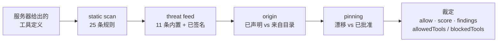

# WARDEN — MCP 安全防火墙

<!-- aicom-readme-badges -->
<p align="center">
  <a href="https://github.com/alexar76/warden/actions/workflows/ci.yml"></a>
  <a href="https://www.npmjs.com/package/@aimarket/warden"></a>
  
  
  = 20" />
  <a href="LICENSE"></a>
</p>
<!-- /aicom-readme-badges -->

<p align="center">
  
</p>


> 🌐 [English](README.md) · [Русский](README-ru.md) · [Español](README-es.md) · [Français](README-fr.md) · **中文** · [术语表](https://github.com/alexar76/aicom/blob/main/docs/localization-glossary.md)

MCP 服务器自己告诉你的智能体，它的工具是做什么的。智能体就信了——而这句话正是攻击面。工具描述就是第三方直接
投递进模型上下文的提示词文本；而一个名叫 `api_key` 的 schema 字段，就是以 API 形式写出来的索要密钥的请求。

WARDEN 在**该服务器的任何工具到达模型之前**审查它，并返回一份可以留档的裁定：允许/阻止、0..1 的评分、导致该
评分的各项发现、按工具的划分，以及当时生效的确切规则表。

```bash
npm install @aimarket/warden
```

**零运行时依赖。** 整个包里唯一的 import 是 `node:crypto`。它就是 [ARGUS](https://github.com/alexar76/argus)
里的那个防火墙，被单独抽出来，好让你把它放在自己的 MCP 宿主前面，而不必换用一个智能体。

## 快速开始

```ts
import { Warden, ThreatFeed, silentLogger } from "@aimarket/warden";

const threatFeed = new ThreatFeed({ feedPublicKey: process.env.FEED_PUBKEY });
await threatFeed.load(process.env.FEED_URL); // 不传 URL → 只用内置拒绝列表，不联网

const pins = new Map();
const warden = Warden.create({
  policy: {
    blockAtSeverity: "high",
    sensitiveToolPatterns: ["*delete*", "*transfer*", "*key*"],
    allowUnknownServers: false, // 失败即关闭：只允许你声明过的服务器
    pinToolDefs: true,
  },
  threatFeed,
  store: {
    getPin: async (id) => pins.get(id),
    putPin: async (p) => void pins.set(p.serverId, p),
  },
  log: silentLogger(), // 或者你自己的 logger
});

const verdict = await warden.vet(server, await client.listTools());

if (!verdict.allow) throw new Error(`被 ${verdict.decidedBy} 阻止`);
const usable = verdict.allowedTools; // 被投毒的工具可以单独隔离
await warden.approve(server, tools); // 把用户认可的内容固定（pin）下来
```

`vet()` **不发起任何网络请求**。WARDEN 唯一会发出的请求，是你把 URL 传给 `load()` 时主动要求的威胁情报
（threat feed）下载。

## 门控链



| 门控 | 判定什么 | 网络 | 是否 fatal |
|---|---|---|---|
| **static-scan** | `description` 与 `inputSchema` 中的注入、外泄、索要凭据，以及隐藏 Unicode/base64 迹象——25 条规则（v2），其中 18 条可阻止、7 条仅提示 | 无 | 否 |
| **threat-feed** | 已知恶意的服务器身份或工具：11 条内置记录，外加可选的已签名 feed | 仅 feed 下载 | 是，服务器范围的 `critical` |
| **origin** | 该服务器是运营者声明的，还是来自远端目录 | 无 | 是，当 `allowUnknownServers: false` |
| **pinning** | 工具定义是否仍与用户批准过的一致 | 无 | 是，当 `pinToolDefs: true` |

综合评分是各门控贡献的**乘积**：一个门控出问题会把整台服务器拉下来，而不是被平均掉。严重级别与是否阻止是两
个独立的维度：带 `advisory` 的发现会被报告，但在任何 `blockAtSeverity` 下都不会阻止连接、也不会牺牲任何工
具——因为「这值得多少注意」和「这到底是不是缺陷」是两个不同的问题，而把后者编码成一个较低的严重级别，会让
它对任何收紧阈值的人重新变成阻止性的。

## 裁定就是为了留档

```ts
{
  allow: false,
  score: 0,
  decidedBy: "threat-feed",
  findings: [{ gate, severity, code: "THREAT_TOOL_MATCH", message, tool, advisory? }],
  allowedTools: ["add"],
  blockedTools: ["sweeper"],
  rulesets: { staticScan: { version: "2", digest: "sha256-gWC14PR4…" } }
}
```

`rulesets` 不是装饰。同一台服务器在更晚的规则表下会得到不同评分；如果既没有版本号、也没有对规则内容的摘要，
就无法把这种情况与「服务器本身变了」区分开。缺了它们，留档的扫描结果不可复现。

## 已签名的威胁情报 feed

WARDEN 不会读取未签名的远端 feed。这个契约刻意做得很枯燥：

```
GET <你的 feed url>
{ "records": [ {pattern, severity, code, reason, source, scope}, … ],
  "timestamp": 1786205907380,   // epoch 毫秒，整数——必填
  "signature": "f588d5a4…"      // 对 {records, timestamp} 的 RFC 8785
}                               // 规范化形式做的 Ed25519 签名（hex）
```

会检查三项性质，且**任何一项失败都保留内置底线**，而不是退化成毫无防护：

1. **真实性**——用你事先固定的公钥（`feedPublicKey`）做 Ed25519 验签；
2. **新鲜度**——*被签名的* timestamp 必须落在 `maxAgeMs` 窗口内（默认 24 小时），这样提供该 URL 的一方就无法
   重放几个月前的快照、悄悄抹掉此后新增的每一条记录。签名说明的是谁写了这份文件，从不说明它是何时交到你手上
   的；
3. **确定性**——RFC 8785 规范化字节，使发布方与验证方无论 JSON 键顺序如何都能对上。

如果你需要一个可以让 `load()` 指向的目标，[MOMUS](https://github.com/alexar76/momus) 是该契约的参考发布方
（`/warden/threat-feed`）。

## 还包含

- **`EgressGuard`**——出网白名单，用来包住工具发出的任何请求。工具去访问你从未列入的主机，正是典型的
  phone-home 迹象。`*.example.com` 覆盖子域；空白名单会阻止一切，而不是放行一切。
- **`isSensitiveTool` / `classifyTools`**——对必须逐次调用都要审批的工具做 glob 分类。敏感工具仍然是*已公布*
  的，只是不能在无人看管的情况下运行。
- **`canonicalize` / `parseJsonStrict`**——严格的 RFC 8785（JCS）实现，同时以 `@aimarket/warden/jcs` 导出，
  便于把另一份实现逐字节对照验证。超出 `MAX_SAFE_JSON_INTEGER` 只接受整数、遇到孤立代理项直接拒绝（而不是转
  义），且每次拒绝都带原因码。

## 文档

| | |
|---|---|
| [门控链](docs/gates.zh.md) | 每一个规则层级、每一个发现码、综合评分如何构成，以及如何新增一个门控 |
| [已签名的威胁情报 feed](docs/threat-feed.zh.md) | 线上契约、三项检查，以及如何发布一个 WARDEN 会接受的 feed |
| [集成指南](docs/integration.zh.md) | 如何把 WARDEN 接入自己的 MCP 宿主、策略取舍，以及应当留档什么 |

## 它不是什么

- **不是沙箱。** 这些都是进程内的 JS 判定。操作系统层面对 MCP 子进程的约束（seccomp/Landlock、
  `sandbox-exec`）不在这里。
- **不是模型。** 整条链上任何位置都不调用 LLM。这正是 `vet()` 快速、离线且确定的原因——也正因如此，静态扫描
  是正则形态的，会漏掉任何规则都没覆盖的改写说法。
- **不是信誉服务。** 早期版本里有一个门控，会向信任预言机索要一个它根本没有数据可算的评分，然后在一个请求都
  没发出的情况下报告预言机不可达。该门控已被移除，并且只要有任何门控再次声称不可达，
  `test/no-phantom-gate.test.ts` 就会失败。
- **不能替代你亲自读工具定义。** 11 条内置威胁记录是底线，不是目录。

## 开发

```bash
npm install && npm run build && npm test   # 96 项测试
```

`test/packaging.test.ts` 正是让标题保持诚实的东西：一旦出现运行时依赖、任何源文件从包外 import、或者入口点不
再导出执行面，它就会失败。

被 [ARGUS](https://github.com/alexar76/argus)（参考宿主）、[MOMUS](https://github.com/alexar76/momus)
（发布方一侧）以及 AICOM 的 MCP 安全课程使用。

MIT © AICOM (alexar76)
