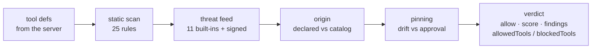

<!-- aicom-mirror-notice -->
> **🔄 Synced from a monorepo — but with a live history.** `warden` mirrors the
> canonical AI-Factory monorepo. History here is append-only (no force-push).
> **Pull requests are welcome** — merged PRs are imported back into the monorepo
> and re-synced here, so your contribution becomes canonical.
> 💬 **[Issues](https://github.com/alexar76/warden/issues)** · **[Pull requests](https://github.com/alexar76/warden/pulls)** both welcome.

# WARDEN — MCP security firewall

<!-- aicom-readme-badges -->
<p align="center">
  <a href="https://github.com/alexar76/warden/actions/workflows/ci.yml"></a>
  <a href="https://warden.modelmarket.dev/"></a>
  <a href="https://warden.modelmarket.dev/"></a>
  
  =20" />
  
  <a href="https://github.com/alexar76/warden/blob/main/LICENSE"></a>
</p>
<!-- /aicom-readme-badges -->

<p align="center">
  <a href="https://warden.modelmarket.dev/">
    
  </a>
</p>


> 🌐 **English** · [Русский](README-ru.md) · [Español](README-es.md) · [Français](README-fr.md) · [中文](README-zh.md) · [Glossary](https://github.com/alexar76/aicom/blob/main/docs/localization-glossary.md)

An MCP server tells your agent what its tools do. The agent believes it — that sentence is the
attack surface. A tool description is prompt text delivered by a third party straight into your
model's context, and a schema field named `api_key` is a request for your secrets phrased as an API.

WARDEN vets a server **before any of its tools reach the model**, and returns a verdict you can
record: allow/block, a 0..1 score, the findings that produced it, a per-tool partition, and the
exact rule table that was in force.

```bash
npm install @aimarket/warden
```

**Zero runtime dependencies.** The only import in the whole package is `node:crypto`. It is the
firewall out of [ARGUS](https://github.com/alexar76/argus), extracted so you can put it in front of
your own MCP host without adopting an agent.

## Quick start

```ts
import { Warden, ThreatFeed, silentLogger } from "@aimarket/warden";

const threatFeed = new ThreatFeed({ feedPublicKey: process.env.FEED_PUBKEY });
await threatFeed.load(process.env.FEED_URL); // omit → built-in deny-list only, no network

const pins = new Map();
const warden = Warden.create({
  policy: {
    blockAtSeverity: "high",
    sensitiveToolPatterns: ["*delete*", "*transfer*", "*key*"],
    allowUnknownServers: false, // fail-closed: only servers you declared
    pinToolDefs: true,
  },
  threatFeed,
  store: {
    getPin: async (id) => pins.get(id),
    putPin: async (p) => void pins.set(p.serverId, p),
  },
  log: silentLogger(), // or your own logger
});

const verdict = await warden.vet(server, await client.listTools());

if (!verdict.allow) throw new Error(`blocked by ${verdict.decidedBy}`);
const usable = verdict.allowedTools; // a poisoned tool can be quarantined alone
await warden.approve(server, tools); // pin what the user accepted
```

`vet()` performs **no network I/O**. The only request WARDEN ever makes is the threat-feed fetch you
asked for by passing a URL to `load()`.

## The gate chain



| Gate | What it decides | Network | Fatal? |
|---|---|---|---|
| **static-scan** | Injection, exfiltration, credential requests and hidden-Unicode/base64 tells in the tool `name`, its `description` and its `inputSchema` — 25 rules, v4, of which 15 can block and 10 are advisory-only, 17 also cover the name, and 12 carry a context guard | none | no |
| **threat-feed** | Known-bad server identity or tool, from 11 built-in records plus an optional signed feed | only the feed fetch | yes, for a server-scoped `critical` |
| **origin** | Whether the operator declared this server or it arrived from a remote catalog | none | yes, under `allowUnknownServers: false` |
| **pinning** | Whether the tool defs still match what the user approved | none | yes, under `pinToolDefs: true` |

The composite score is the **product** of gate contributions, so one bad gate drags the whole server
down rather than being averaged away. Severity and blocking are separate axes: an `advisory` finding
is reported and never blocks and never costs a tool, at any `blockAtSeverity` — because "how much
attention does this deserve" and "is this a defect at all" are different questions, and encoding the
second as a low severity made it blocking again for anyone who tightened the threshold.

## The verdict is meant to be recorded

```ts
{
  allow: false,
  score: 0,
  decidedBy: "threat-feed",
  findings: [{ gate, severity, code: "THREAT_TOOL_MATCH", message, tool, advisory? }],
  allowedTools: ["add"],
  blockedTools: ["sweeper"],
  rulesets: { staticScan: { version: "4", digest: "sha256-klRyTiD3…" } }
}
```

`rulesets` is not decoration. The same server scores differently under a later rule table, and
without the version *and* a digest over the rules there is no way to tell that apart from the server
having changed. A stored scan without them is not reproducible.

## Signed threat feed

WARDEN will not read an unsigned remote feed. The contract is deliberately boring:

```
GET <your feed url>
{ "records": [ {pattern, severity, code, reason, source, scope}, … ],
  "timestamp": 1786205907380,   // epoch ms, integer — required
  "signature": "f588d5a4…"      // Ed25519 (hex) over the RFC 8785 canonical
}                               // form of {records, timestamp}
```

Three properties are checked, and **any failure keeps the built-in floor** rather than degrading to
no protection:

1. **authenticity** — Ed25519 against the key you pinned in advance (`feedPublicKey`);
2. **freshness** — the *signed* timestamp must be inside `maxAgeMs` (24 h by default), so whoever
   serves the URL cannot replay a months-old snapshot and silently erase every record added since.
   A signature says who wrote a document, never when you were handed it;
3. **determinism** — RFC 8785 canonical bytes, so publisher and verifier agree regardless of JSON
   key order.

[MOMUS](https://github.com/alexar76/momus) is a reference publisher of this contract
(`/warden/threat-feed`) if you want something to point `load()` at.

## Also in the box

- **`EgressGuard`** — an outbound allowlist to wrap any request a tool makes. A tool reaching a host
  you never listed is the classic phone-home tell. `*.example.com` matches subdomains; an empty
  allowlist blocks everything rather than allowing everything.
- **`isSensitiveTool` / `classifyTools`** — glob classification of tools that must require per-call
  approval. Sensitive tools stay *advertised*; they just cannot run unattended.
- **`canonicalize` / `parseJsonStrict`** — a strict RFC 8785 (JCS) implementation, also exported as
  `@aimarket/warden/jcs` so another implementation can be byte-checked against it. Integers only
  beyond `MAX_SAFE_JSON_INTEGER`, refusal (not escaping) on lone surrogates, and a reason code on
  every refusal.

## Documentation

| | |
|---|---|
| [The gate chain](docs/gates.md) | Every rule tier, every finding code, how the composite score is built, and how to add a gate |
| [The signed threat feed](docs/threat-feed.md) | The wire contract, the three checks, and how to publish a feed WARDEN will accept |
| [Integration guide](docs/integration.md) | Wiring WARDEN into your own MCP host, policy choices, and what to record |
| [Field survey: 1 108 public MCP servers](docs/mcp-survey.md) | What WARDEN decided on real third-party tool definitions — 50 servers blocked, 4 substantiated, and the six ways the rest were wrong |

## What this is not

- **Not a sandbox.** These are in-process JS decisions. OS-level confinement of the MCP child
  process (seccomp/Landlock, `sandbox-exec`) is not here.
- **Not a model.** No LLM is called anywhere in the chain. That is why `vet()` is fast, offline and
  deterministic — and why the static scan is regex-shaped and will miss a paraphrase no rule covers.
- **Not a reputation service.** An earlier version had a gate that asked a trust oracle for a score
  it had no data to compute, then reported the oracle as unreachable without having sent a request.
  It was removed, and `test/no-phantom-gate.test.ts` fails if any gate ever claims unreachability
  again.
- **Not a substitute for reading the tool defs.** 11 built-in threat records is a floor, not a
  catalog.

## Development

```bash
npm install && npm run build && npm test   # 149 tests
```

`test/packaging.test.ts` is what keeps the headline honest: it fails if a runtime dependency appears,
if any source file imports outside the package, or if the entry point stops exporting the
enforcement surface.

Used by [ARGUS](https://github.com/alexar76/argus) (the reference host), [MOMUS](https://github.com/alexar76/momus)
(the publisher side), and the AICOM MCP-security course.

MIT © AICOM (alexar76)
